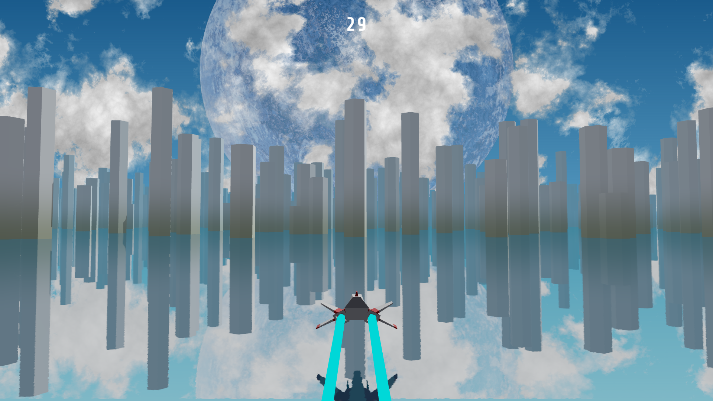

---

# 🚀 Spaceship Runner 3D

A fast-paced, web-based 3D runner game built with **Three.js**. Pilot your spacecraft through treacherous asteroid fields and alien environments across three distinct planets. Survive long enough, and your hyperdrive will engage, blasting you to the next planetary challenge!

#### 🎮 **[Live Demo Click Here](https://spaceship-threejs.vercel.app/)**

---

## 📸 Screenshots

---

## ✨ Features

* **Three Unique Planets:** Progress through 3 visually distinct levels, each with its own color palette, obstacle types, and atmosphere.
* **Time-Based Progression:** No finish line—just pure survival. Dodge obstacles for a set amount of time to trigger the warp sequence to the next planet.
* **Fully 3D Environment:** Built from the ground up using Three.js and WebGL.

---

## 🕹️ How to Play

* **Move Left:** `Left Arrow` or `A`
* **Move Right:** `Right Arrow` or `D`
* **Objective:** Avoid the incoming asteroids, debris, and planetary hazards. Watch the timer at the top of the screen—survive until it hits zero to warp to the next stage!

---

## 🛠️ Technologies Used

* **Three.js** - For rendering the 3D graphics, lighting, and camera work.
* **JavaScript (ES6)** - Game logic and state management.
* **HTML5/CSS3** - UI overlays (timer, start screen, game over screen).

---
